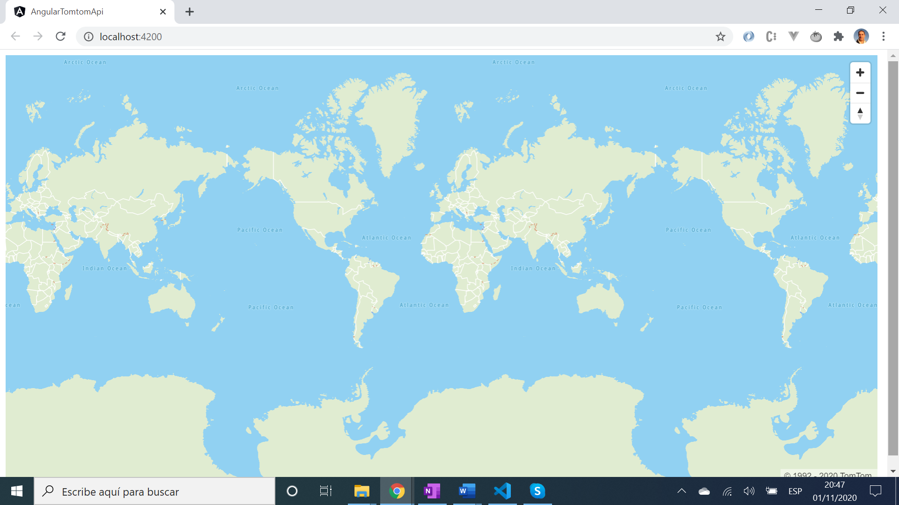
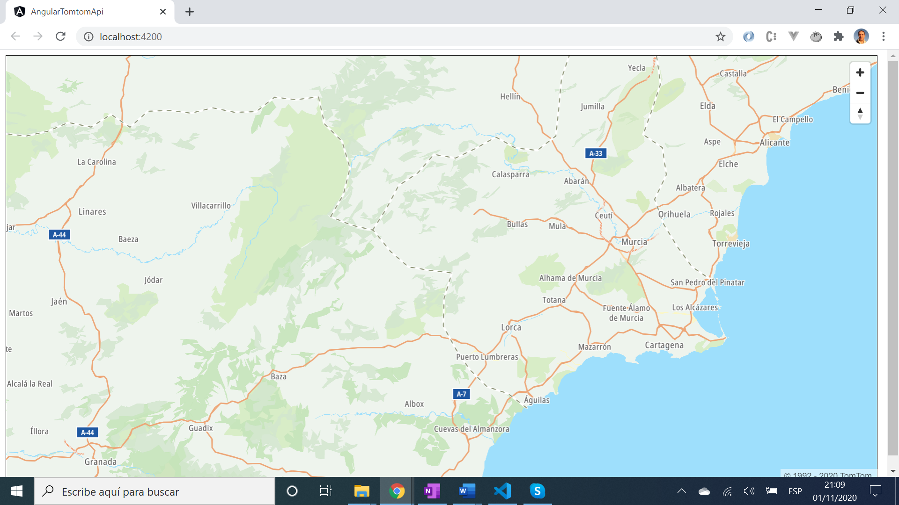

# :zap: Angular Tomtom API

* Angular app to display map data from the [Tomtom API](https://developer.tomtom.com/)

*** Note: to open web links in a new window use: _ctrl+click on link_**

## :page_facing_up: Table of contents

* [:zap: Angular Tomtom API](#zap-angular-tomtom-api)
  * [:page_facing_up: Table of contents](#page_facing_up-table-of-contents)
  * [:books: General info](#books-general-info)
  * [:camera: Screenshots](#camera-screenshots)
  * [:signal_strength: Technologies](#signal_strength-technologies)
  * [:floppy_disk: Setup](#floppy_disk-setup)
  * [:computer: Code Examples](#computer-code-examples)
  * [:cool: Features](#cool-features)
  * [:clipboard: Status & To-Do List](#clipboard-status--to-do-list)
  * [:clap: Inspiration](#clap-inspiration)
  * [:envelope: Contact](#envelope-contact)

## :books: General info

* Displays a [Tomtom zoomable map](https://developer.tomtom.com/maps-api/maps-api-documentation)
* The map module result in a build vendor chunk size of 3.59 MB
* Updated to Angular version 11 & dependencies updated nov 2020

## :camera: Screenshots




## :signal_strength: Technologies

* [Angular v11](https://angular.io/)
* [Node module: @tomtom-international/web-sdk-maps v5](https://www.npmjs.com/package/@tomtom-international/web-sdk-maps)
* [Tomtom developer API](https://developer.tomtom.com/)

## :floppy_disk: Setup

* Install dependencies by running `npm i`
* See [Tomtom: Angular Map Display API integration tutorial](https://developer.tomtom.com/maps-sdk-web-js-public-preview/tutorials-basic/angular-map-display-api-integration-tutorial) and add code as shown
* Get yourself an [API key from Tomtom](https://developer.tomtom.com/how-to-get-tomtom-api-key) - it's free :-)
* Run `ng test to run some simple Jasmin tests`on Karma
* Run `ng serve` to start a server on port 4200
* Run `ng lint` to check syntax using TSLint. Currently all files passing :-) Note [TSLint will be replaced with ESLint](https://github.com/palantir/tslint/issues/4534)

## :computer: Code Examples

* extract from `app.component.ts` to set up Tomtom map constant

```typescript
    import tt from '@tomtom-international/web-sdk-maps';

    const map = tt.map({
        key: '<your maps api key>',
        style: 'tomtom://vector/1/basic-main',
        container: 'map'
    });
```

## :cool: Features

* not much code required to get a zoomable world map
* Some basic Jasmine tests added that all pass

## :clipboard: Status & To-Do List

* Status: Working
* To-Do: add functionality. Add routing or remove routing module

## :clap: Inspiration

* [Tomtom: Angular Map Display API integration tutorial](https://developer.tomtom.com/maps-sdk-web-js-public-preview/tutorials-basic/angular-map-display-api-integration-tutorial)

## :envelope: Contact

* Repo created by [ABateman](https://www.andrewbateman.org) - you are welcome to [send me a message](https://andrewbateman.org/contact)
