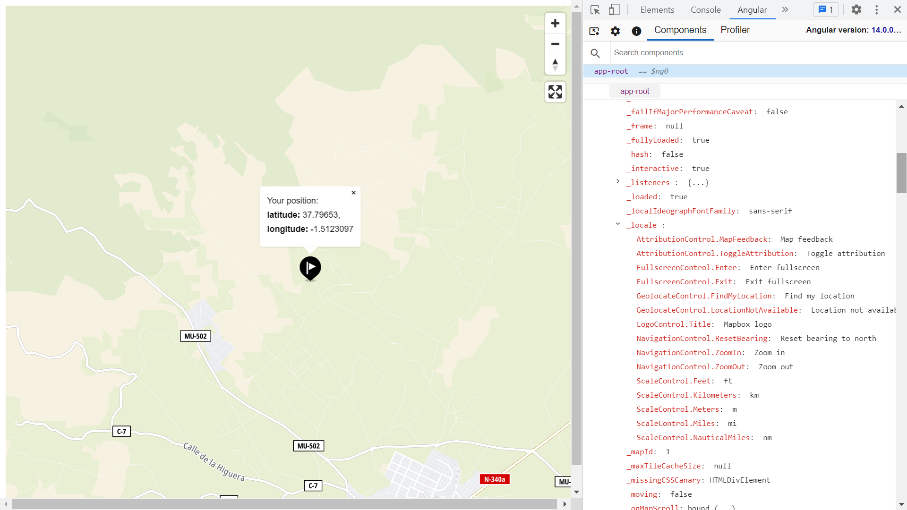

# :zap: Angular Tomtom API

* Angular app to display map data from the [Tomtom API](https://developer.tomtom.com/)
* **Note:** to open web links in a new window use: _ctrl+click on link_


*** Note: to open web links in a new window use: _ctrl+click on link_**

## :page_facing_up: Table of contents

* [:zap: Angular Tomtom API](#zap-angular-tomtom-api)
  * [:page_facing_up: Table of contents](#page_facing_up-table-of-contents)
  * [:books: General info](#books-general-info)
  * [:camera: Screenshots](#camera-screenshots)
  * [:signal_strength: Technologies](#signal_strength-technologies)
  * [:floppy_disk: Setup](#floppy_disk-setup)
  * [:computer: Code Examples](#computer-code-examples)
  * [:cool: Features](#cool-features)
  * [:clipboard: Status & To-Do List](#clipboard-status--to-do-list)
  * [:clap: Inspiration](#clap-inspiration)
  * [:file_folder: License](#file_folder-license)
  * [:envelope: Contact](#envelope-contact)

## :books: General info

* Displays a [Tomtom](https://developer.tomtom.com/maps-api/maps-api-documentation) zoomable map that shows user position with full-screen and zoom options

## :camera: Screenshots



## :signal_strength: Technologies

* [Angular v14](https://angular.io/)
* [Node module: @tomtom-international/web-sdk-maps v6](https://www.npmjs.com/package/@tomtom-international/web-sdk-maps)
* [Tomtom developer API](https://developer.tomtom.com/)

## :floppy_disk: Setup

* Install dependencies by running `npm i`
* See [Tomtom: Angular Map Display API integration tutorial](https://developer.tomtom.com/maps-sdk-web-js-public-preview/tutorials-basic/angular-map-display-api-integration-tutorial) and add code as shown
* Get yourself an [API key from Tomtom](https://developer.tomtom.com/how-to-get-tomtom-api-key) - it's free :-) and add it to `environment.ts`
* Run `ng serve` to start a server on port 4200
* Run `npm run build` to create build file in `dist/angular-tomtom-api` directory.

## :computer: Code Examples

* extract from `app.component.ts`: function to get user position

```typescript
private getUserPosition = (): Observable<Position> => {
    const userPosition = new Observable((observer: Subscriber<any>) => {
      navigator.geolocation
        ? navigator.geolocation.getCurrentPosition((pos: any) => {
            observer.next({
              latitude: pos.coords.latitude,
              longitude: pos.coords.longitude,
            });
            observer.complete();
          })
        : observer.error();
    });
    return userPosition;
  };
```

## :cool: Features

* Not much code required to get a zoomable world map

## :clipboard: Status & To-Do List

* Status: Working. Size of build file: 3.83MB - mostly Vendor files
* To-Do: Nothing

## :clap: Inspiration

* [Tomtom: Angular Map Display API integration tutorial](https://developer.tomtom.com/maps-sdk-web-js-public-preview/tutorials-basic/angular-map-display-api-integration-tutorial)
* [Tomtom documentation](https://developer.tomtom.com/maps-sdk-web-js/tutorials/use-cases/how-add-and-customize-location-marker)

## :file_folder: License

* This project is licensed under the terms of the MIT license.

## :envelope: Contact

* Repo created by [ABateman](https://github.com/AndrewJBateman), email: gomezbateman@yahoo.com
